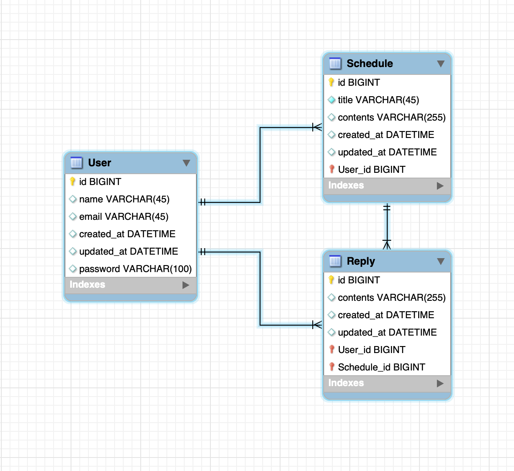

# Schedule Manager with JPA!
JDBC를 사용하여 간단한 [일정관리 프로그램](https://velog.io/@yong-lee/Spring-%EC%9D%BC%EC%A0%95-%EA%B4%80%EB%A6%AC-API-%EB%A7%8C%EB%93%A4%EA%B8%B0)을 만들어봤습니다.
이번에는 JPA를 사용할 예정이며, 전에 만들었던 것에서 조금 더 나아가 더 많은 시도를 해볼 생각입니다.

***
# 기술 스택
- Backend: Spring Boot (v3.4.3), Java, JPA, Lombok

- Database: MySQL

- API 테스트: Postman

***
## Developing Principles
- 모든 테이블은 고유 식별자(ID)를 가진다.
- `3 Layer Architecture` 형식으로 개발한다.
- CRUD 필수 기능은 모두 데이터베이스 연결 및 `JPA`를 사용해서 개발한다.
- 인증/인가 절차는 `Cookie/Session`을 활용하여 개발한다.
- JPA 연관관계는 특별한 상황이 아니면`단방향`으로 한다.

***
# What I do at each level...
## Lv.0
- [ ]  Readme.md 파일을 작성
- [ ]  ERD 작성
- [ ]  API 명세서 작성
- [ ]  [GitHub lv.0 코드 보러 가기](https://github.com/YongLeeCode/ScheduleManagerWithJpa/tree/lv.0)  
- [ ]  [블로그 Lv.0 : API 명세서 및 ERD](https://velog.io/@yong-lee/JPA-%EC%9D%BC%EC%A0%95-%EA%B4%80%EB%A6%AC-API-%EB%A7%8C%EB%93%A4%EA%B8%B0-Lv-0)

## Lv.1
- [ ]  일정(Schedule) 테이블의 생성, 조회, 수정, 삭제 구현.
- [ ]  일정 테이블의 구성
    - [ ]  `작성 유저명`, `할일 제목`, `할일 내용`, `작성일`, `수정일`
    - [ ]  `작성일`, `수정일` 필드는 `JPA Auditing`을 활용.

## Lv.2
- [ ]  유저 테이블의 생성, 조회, 수정, 삭제 구현.
- [ ]  유저 테이블의 구성
    - [ ]  `유저명`, `이메일`, `작성일` , `수정일` 필드
    - [ ]  `작성일`, `수정일` 필드는 `JPA Auditing`을 활용.
- [ ]  연관관계 구현
    - [ ]  일정의 `작성 유저명` 필드 -> 유저의 `고유 식별자` 필드

## Lv.3
- [ ]  유저 테이블에 `비밀번호` 필드 추가.
    - 비밀번호 암호화 x

## Lv.4
- [ ] Cookie/Session을 활용해 로그인 기능 구현
    - [ ] `이메일`과 `비밀번호`를 활용     
- [ ] 필터를 활용해 인증 처리
    - [ ] 회원가입, 로그인 요청은 인증 처리에서 `제외`
- [ ] 예외처리 : Status 401 
    - [ ] 잘못된 이메일 입력  
    - [ ] 잘못된 비밀번호 입력
    - [ ] 이메일과 비밀번호가 일치하지 않을 경우

## Lv.5
- [ ] Validation 활용한 예외처리
    - [ ] 일정 title은 10글자 이내
    - [ ] 유저명은 7글자 이내
    - [ ] 유저명은 숫자 혹은 영어 혹은 한글만 가능
    - [ ] @Pattern을 이용한 email 데이터 검증

## Lv.6
- [ ] 비밀번호 암호화
    - [ ] PasswordEncoder를 직접 만들어 사용

## Lv.7
- [ ]  댓글 테이블의 생성, 조회, 수정, 삭제 기능 구현
- [ ]  댓글과 일정은 연관관계를 가짐.
- [ ]  댓글과 유저는 연관관계를 가짐.
- [ ]  댓글 테이블의 구성
    - [ ]  `댓글 내용`, `작성일`, `수정일`, `유저 고유 식별자`, `일정 고유 식별자`

## Lv.8
- [ ] 일정의 페이지네이션 구현
    - [ ] pageable 인터페이스 활용
    - 페이지 크기: 10
    - 수정일 기준 내림차

***

### [자세한 사항은 블로그에서 확인해주세요.](https://velog.io/@yong-lee/JPA-%EC%9D%BC%EC%A0%95-%EA%B4%80%EB%A6%AC-API-%EB%A7%8C%EB%93%A4%EA%B8%B0-Lv-0)
## API 명세서